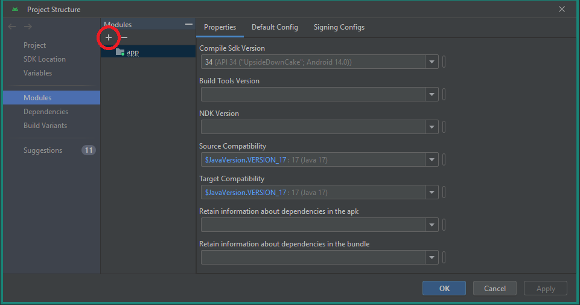
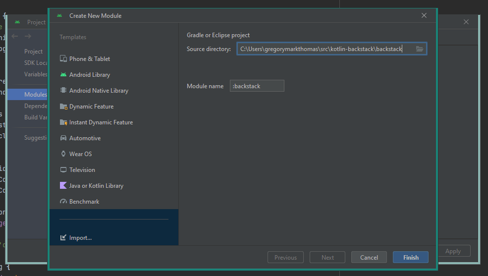

# kotlin-backstack

Backstack for Model-View-Presenter (MVP) _Views_ in a Fragment-less design, written in Kotlin.

## Why?

With an MVP architecture, you may want to do away with Android's Fragments, keep Activities to a minimum,
and have clean Models, Views and Presenters.
To manage your Views, some kind of backstack is required...


## How do I use this library?

### 1. `git clone` this library to your machine

Put this somewhere easily-accessible.


### 2. Add the library to your project

This can be done in one of two ways:

#### As a _library_ module

- a. In Android Studio, right-click your project in the 'Project' tab, and select _Open Module Settings_ 
- b. Click the + (circled) to add a module 
- c. In the _Create New Module_ window, under _Import..._, set the _Source Directory_ to the **inner `backstack` module within the saved library project** (i.e. `backstack/backstack`)


#### .aar file

- a. Copy `backstack/backstack/build/outputs/aar/backstack-release.aar` 
- b. Paste to `<app-name>/<app-module>/libs/`
- c. Ensure your app module's Gradle _build script_ imports `backstack-release.aar`:

Gradle _build configuration scripts_ are written in either Groovy DSL or Kotlin DSL (domain-specific language).

If Kotlin DSL (`build.gradle.kts`):

```kotlin
dependencies {
    implementation(files("libs/backstack-release.aar"))
}
```

If Groovy DSL (`build.gradle`):

```groovy
dependencies {
    implementation files('libs/backstack-release.aar')
}
```

#### Include `constraintlayout` library to your app module's _build configuration script_

If Kotlin DSL (`build.gradle.kts`):

```kotlin
dependencies {
    implementation("androidx.constraintlayout:constraintlayout:2.1.4")
}
```

If Groovy DSL (`build.gradle`):

```groovy
dependencies {
    implementation 'androidx.constraintlayout:constraintlayout:2.1.4'
}
```

### 3. Setup your Activity 

Ensure it extends `BackstackActivity()` and not the default `ComponentActivity()`.

Below is a guide of an Activity implementation: you can view a working example in the `backstackexample` module of this project.

```kotlin
class MainActivity : BackstackActivity() {
    private lateinit var binding: ActivityMainBinding
    
    /**
     * Notes:
     * - View Binding (https://developer.android.com/topic/libraries/view-binding) is in-use
     * - Call to `super.onCreate()` needs to be at end
     */
    override fun onCreate(savedInstanceState: Bundle?) {
        binding = ActivityMainBinding.inflate(layoutInflater)
        setContentView(binding.root)
        model = Model()
        super.onCreate(savedInstanceState)
    }

    override fun getInitialView(): BackStackView {
        return AView()
    }

    override fun addView(view: BackStackLayout) {
        binding.root.addView(view)
    }

    override fun removeAllViews() {
        binding.root.removeAllViews()
    }

    override fun getModel(): ModelInterface {
        return model
    }
}
```

### Setup your view(s)

Assumption: you already have an MVP architecture setup for this application - if not, see the code in `backstackexample` for an example:

```kotlin
class AView: BackStackView() {
    private lateinit var presenter: APresenterInterface
    private lateinit var binding: AViewBinding

    /********** public */
    override fun getTag(): String = "AView"

    override fun getLayout(): Int = R.layout.a_view

    /** TODO: complete this!!
     * This is called by the PresenterInterface.
     * We used to do this in initialisePresenter(), but the view wasn't yet drawn when we were retrieving the height of the RecyclerView to determine the size of each Day view.
     * So, PresenterInterface now controls when it is created.
     * We want to show 7 days per row, so we need 7 columns for the adapter.
     */
    override fun onViewInitialised(backstack: BackStackInterface, model: ModelInterface, context: AndroidContextInterface) {
        binding = MonthViewBinding.bind(view!!)
        setupTodayButton()
        setupAdapter(context)
        /** This should be last. **/
        this.presenter = CalendarPresenter(this,
            model as CalendarModelInterface, backstack, permissionChecker, dialogViewer, date)
    }
}
```